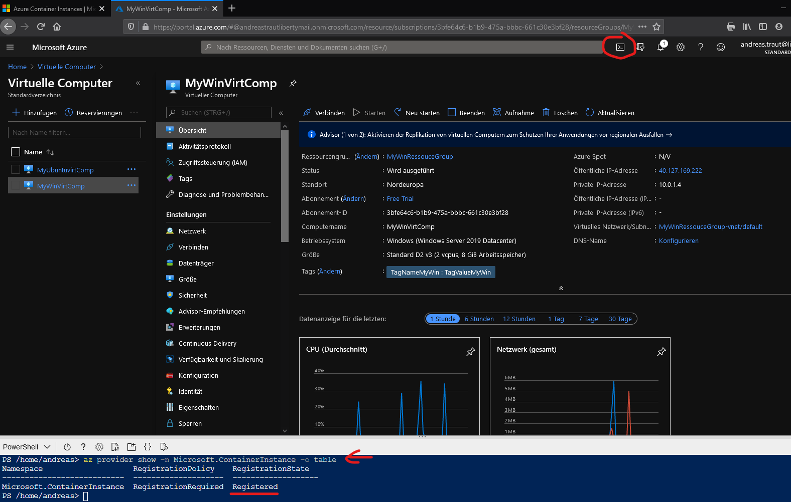
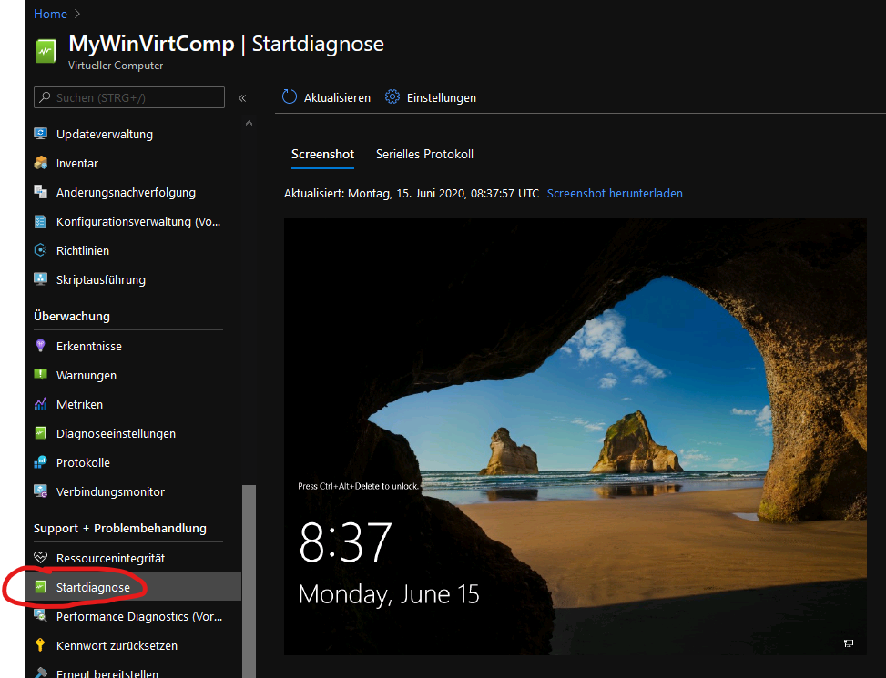
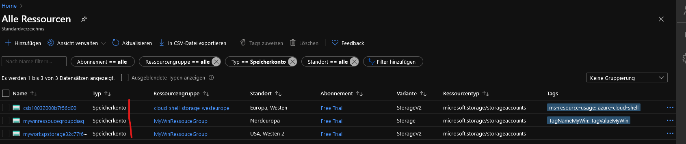

Author: Andreas Traut  
Date: 17.06.2020  
[Download als PDF](https://github.com/AndreasTraut/Experiences-with-MicrosoftAzure/raw/master/README.pdf)  
Please read also the "**Summary**" at the end of this documentation for knowing what I learnt.  

# Microsoft Azure Portal for “Data Science”

## Introduction

After having made experiences in Phyton, Jupyter-Notebooks and various
data science topics, my aim was to dig deeper into cloud computing
platforms. I choose *“Microsoft Azure”* as it seemed the best option
regarding both criteria “pricing” and
“privacy” (Google or Amazon seemed to me less ideal either in “costs”
or in “privacy”).

In this document I will describe my first experiences with *“Microsoft
Azure”*. My aim was to create an Azure account, get familiar with it to
run my Jupyter-Notebooks on a virtual machine and develop other data
science tools. I will touch different topics in this document, like

  - ***“configuration steps”***: what do I need to know to set up
    everything (e.g. a virtual machine)?

  - ***“billing aspects”***: what aspects are relevant regarding the
    costs?

  - ***“issue solving”***: what can I do if I have technical issues?

I did not have any mentor or training material apart of the Microsoft
documentation, which I found on their website. It was a jump directly
into the “real-world” and I can definitively say: I learnt a lot with
this hands-on approach. Please read also the "Summary" at the end of the documentation for knowing what I learnt. 

## Create an Azure Account

First, I needed to create an Microsoft Azure account. Microsoft offers a
“free” Azure Account here:

<https://azure.microsoft.com/en-us/free/>

“Free” means, that you will have access for 12 months on popular
services like “File Storage”, “Virtual Machines”, “SQL Databases”, but
limited to a maximum usage (e.g. 5 GB of storage, 750 hours of usage…).
Included in this “Free” subscription are about 170 Euros for special
Azure services, which you can use in the first month (30 days).

My first attempt was to register immediately using the link above. But I
recommend making use of pre-configured machines for the purpose of doing
“Data Science” and to open a new Azure Account by starting here:

> “Data Science Virtual Machines” (pre-configured machines)  
> <https://azure.microsoft.com/en-us/services/virtual-machines/data-science-virtual-machines/>

Then you need to go through the Azure configuration steps, which
requires to decide if you want to go for a Linux or a Windows
configuration (I did both to better understand the differences).

During the configuration process you need to choose names for the
following components:

  - **Azure Resource Manager** ist der Bereitstellungs- und
    Verwaltungsdienst für Azure. Er bietet eine Verwaltungsebene, die
    das Erstellen, Aktualisieren und Löschen von Ressourcen in Ihrem
    Azure-Konto ermöglicht.

  - Ein **Azure Storage-Konto** enthält all Ihre Azure
    Storage-Datenobjekte: Blobs, Dateien, Warteschlangen, Tabellen und
    Datenträger. Das Speicherkonto stellt einen eindeutigen Namespace
    für Ihre Azure Storage-Daten bereit, auf den von jedem Ort der Welt
    aus über HTTP oder HTTPS zugegriffen werden kann. Daten in Ihrem
    Azure Storage-Konto sind dauerhaft und hochverfügbar, sicher und
    extrem skalierbar.

  - **Azure Virtual Network (VNET)** ist der grundlegende Baustein für
    Ihr privates Netzwerk in Azure. Mit VNET können zahlreiche Arten von
    Azure-Ressourcen (beispielsweise virtuelle Azure-Computer) sicher
    untereinander sowie mit dem Internet und mit lokalen Netzwerken
    kommunizieren. VNET ähnelt einem herkömmlichn Netzwerk, das Sie in
    Ihrem Rechenzentrum betreiben, bietet jedoch zusätzliche Vorteile
    der Infrastruktur von Azure, z. B. Skalierbarkeit, Verfügbarkeit und
    Isolation.

  - Eine **Netzwerkschnittstelle** ermöglicht einem virtuellen
    Azure-Computer die Kommunikation mit Internet, Azure und lokalen
    Ressourcen.

  - Der virtuelle Computer kann **Datenträger** enthalten, um die
    Speicherkapazität zu erhöhen.

I used *“My…”* as a prefix for all names which I was asked for during
the installation process in order to distinguish better (e.g.
*MyRessourcegroup*, *MyvirtComputer*,….). Don’t worry, if you don’t
understand what the difference is between a *“Storage-Konto”* and a
*“Datenträger”* or what the purpose of these components is. You will
learn it later.

You will also have to decide for size, speed, … of the storage and CPUs,
which will lead to different monthly costs at the end. There is a cost
calculator and you can spend some hours for understanding pros and cons
of these components:

<https://azure.microsoft.com/de-de/pricing/>

But as you earned 170 Euro for your registration to the Microsoft Azur
Portal which you can use during the first month of your registration it
does not matter what you choose here. Later you will have to dig deeper
into the “cost-analysis” again, because a virtual machine with all these
nice components (as described above) can easily cost between 10 and 150
Euro per month. Therefore think about your configuration and costs, but
it is not necessary to think about it at this point in time. I will come
back to this point later.

At the end of the installation process you will see the Azure Portal.
The “Home” screen looks like this:

My components for doing “Data Science” are already configured. When you
go to “Alle Ressourcen” you will see the following (as I configured one
Virtual Machines for Linux and one for Windows, I have a bit more
components here):

When you choose “Weitere Dienste” on the “Home” screen you will see that
there are tons of further configurations (see the red arrow on the right
side) as follows:

You really do not need to understand what is going on here in detail but
having a glance at the Azure portal can be helpful to see the complexity
and variety of the Azure Portal. Take a bit of time to navigate through
this portal. It can be confusing in the beginning.

As I guided you in my short manual directly to the pre-configured “Data
Science Virtual Machines” the required components (here: *“Virtuelles
Netzwerk”*, *“Netzwerkschnittstelle”*, *“Speicherkonto”*, *“Virtueller
Computer”*) have already been set automatically during the configuration
process. My first attempt was to have a clean, empty Azure Portal (using
<https://azure.microsoft.com/en-us/free/>) and adding step-by-step the
components from this list. I can assure you: this is a bad approach for
beginners because you will get lost. Better follow my described approach
above.

## Connect to the virtual computer

Now as we have our configuration done we will want to connect to our
virtual computer (=virtual machine=VM). In the Azure portal you can
select your virtual computer (e.g. mine is named *“MyWinVirtComp”*).
Then click on *“Verbinden”* and choose *“RDP”* as follows (there are
other ways to connect to a virtual computer, like SSH or Bastion, but we
do not go into these details here):

This will connect you to your virtual computer. You will probably need
to accept some warnings concerning certificates popping up like this
one:

Then you should be connected to your virtual computer, which looks like
this:

As you can see from the screenshot it has already lots of pre-installed
tools and popular data analytics tools, as for example Visual Studio,
Power BI, Jupyter Notebook and so on for data science development, data
exploration and modelling tasks. Find an explanation about the Data
Science Virtual Machine here:
<https://docs.microsoft.com/en-us/azure/machine-learning/data-science-virtual-machine/vm-do-ten-things>

  - Share code with your team by using GitHub. Access your repository by
    using the pre-installed Git clients: Git Bash and Git GUI.

  - Use a Jupyter notebook to experiment with your data in a browser by
    using Python 2, Python 3, and Microsoft R.

  - Explore data and develop models locally by using Microsoft Machine
    Learning Server and Python.

  - Deploy models built through R and Python on Azure Machine Learning
    so client applications can access your models by using a simple web
    service interface.

  - Extend your storage space and share large-scale datasets/code .
    Access Azure data and analytics services like Azure Blob storage,
    Azure Data Lake, Azure Cosmos DB, Azure SQL Data Warehouse, and
    Azure SQL Database.

  - Build reports and a dashboard by using the Power BI Desktop

  - Dynamically scale your virtual computer to meet your project's
    needs.

  - Install additional tools on your virtual machine.

I will not try to dig into all possible applications but the first
bullets seemed interesting to me and I get into these topics.

## Use “Git Bash” and run a Jupyter-Notebook on my virtual computer

As a first step I decided to use *“Git Bash”* and download my
Github-Repository *“Visualization-of-Data-with-Python”* from Github as
follows:

Now I needed to type:

git clone
<https://github.com/AndreasTraut/Visualization-of-Data-with-Python>

as you can see in the following screenshot: 

As a result, a folder *“Visualization-of-Data-with-Python”* was created
on my virtual computer, into which the repository had been downloaded as
follows:

Another possibility instead of using the *“Git Bash”* would have been to
use the *“Visual Studio 2019”* and click on *“Clone and check out
code”*:

Next, I opened *“Jupyter”* as follows:

A browser (e.g. Firefox-Browser) will open and I had to navigate to the
new folder *“Visiualization-of-Data-with-Python”* as follows:

I decided to test, if my Jupyter-Notebook “*ConsumerPrices.ipynb*” is
working on the virtual machine and got a message, that “seaborn” has not
yet been installed:

I needed to install it by typing

pip install seaborn

as follows:

After this, the notebook worked as on my personal computer and I knew,
that I can continue with my Jupyter projects on the virtual machine as
usual and as I already showed in other Github-Repositories. Great.

I do not want to get deeper into the development of Jupyter-Notebooks
here, because my aim was to make experiences with Microsoft Azure and
virtual machines. The tests as described above were a sufficient proof
for me that I could continue from this point on whenever I want.

Next, I wanted to test, how *“Visual Studio 2019”* works with *“.py”*
files and therefore opened my Github repository *“pedestrians.py”*.
Similarly, as in the Jupyter-notebook above I needed to install some
packages like *“pandas”* and *“matplotlib”* as they have not been
installed yet on the virtual machine, by typing

pip install pandas

as follows:

After having installed all necessary packages I was able to use the
Microsoft *„Visual Studio 2019“* for debugging python files. Similarly,
here: I don’t want to dig deeper into this topic as this is not the
purpose here. And I am already familiar with another IDE (=integrated
developer environment), called Anaconda Spyder, which I can recommend
(it is available for free).

## Azure Machine Learning and Azure Container Instances

As a next example I wanted to have a look at the *“Azure Machine
Learning Jupyter Notebooks”*. I will only touch on this topic and you
can skip this chapter (or only cross read quickly) if you are more
interested into learning about my experiences on “Cost Analysis” and
“Issue Solving”, which are perhaps a bit more interesting and which
you will find in separate chapters below. But I find it helpful to also
provide some documentation on *“Azure Machine Learning”* as it shows at
a glance, how things around “virtual computers” can become complicated
quickly.

To begin with *“Azure Machine Learning”* I had to go through the
*“configuration.ipynb”* as follows:

Azure Machine Learning uses of [Azure Container Instance
(ACI)](https://azure.microsoft.com/services/container-instances) to
deploy dev/test web services. Before I continue describing the next
installation steps, I will introduce the concept of “Containers”. You
can read about *“Azure Container Instances”* here:

<https://azure.microsoft.com/en-us/services/container-instances/>

For doing this I will start with „Docker“: according to wikipedia
“Docker is a computer program that performs operating-system-level
virtualization, also known as ‘containerization’ ”. The Docker-Website
<https://www.docker.com/resources/what-container> explains what
*“Containers”* are and what the difference to a *“Virtual Machine”*
is:

***Containers*** are an abstraction at the app layer that packages code
and dependencies together. Multiple containers can run on the same
machine and share the OS kernel with other containers, each running as
isolated processes in user space. Containers take up less space than VMs
(container images are typically tens of MBs in size), can handle more
applications and require fewer VMs and Operating systems.

**Virtual machines (VMs)** are an abstraction of physical hardware
turning one server into many servers. The hypervisor allows multiple VMs
to run on a single machine. Each VM includes a full copy of an operating
system, the application, necessary binaries and libraries - taking up
tens of GBs. VMs can also be slow to boot.

Therefore, a container is basically a Virtual Machine without a
hypervisor. These containers can be preconfigured with scripts to
install specific software and provide customized functionality.

On
<https://docs.microsoft.com/en-us/azure/container-instances/container-instances-overview>
you can read: “Containers are becoming the preferred way to package,
deploy, and manage cloud applications. Azure Container Instances offers
the fastest and simplest way to run a container in Azure, without having
to manage any virtual machines and without having to adopt a
higher-level service. Azure Container Instances is a great solution for
any scenario that can operate in isolated containers, including simple
applications, task automation, and build jobs. For scenarios where you
need full container orchestration, including service discovery across
multiple containers, automatic scaling, and coordinated application
upgrades, we recommend [Azure Kubernetes Service
(AKS)](https://docs.microsoft.com/en-us/azure/aks/).”

**Azure Command-Line Interface (CLI):** The next step is to use the
Azure Command Line Interface (CLI). Documentation on the Azure
Command-Line Interface (CLI) can be found here
<https://docs.microsoft.com/en-us/cli/azure/?view=azure-cli-latest>

Open the Azure portal and open the Powershell (see red marking in this
screenshot, more documentation here
<https://docs.microsoft.com/en-us/azure/cloud-shell/quickstart>):

Then type “az –version” to get the current version number. If an update
is needed you can follow the documentation here:
<https://docs.microsoft.com/en-us/cli/azure/install-azure-cli-apt?view=azure-cli-latest#update>

This documentation describes, that an update should be done by typing

sudo apt-get update && sudo apt-get upgrade

Commands which begin with “sudo” should be entered in the virtual
computer in “Ubuntu”, see this screenshot:

You can check if an Azure Container Instance has already been registered
by opening the “Microsoft Azure PowerShell” on your virtual Computer
(see blueish icon on top left) and typing the command:

az provider show –n Microsoft.ContainerInstance -o table

I opened the Azure Portal and used the “Bash” (see red circle) to type
in this command: 

**Configure your Azure ML workspace:** Now let’s continue following the
instructions in the *“configuration.ipynb”* Jupyter Notebook and
configure a Azure Machine Learning (ML) workspace. First we have to set
some variables. You need your subscription ID, your RessourceGroupName,
a WorkSpaceName (which is new) and a WorkspaceRegion:

> import os  
> subscription\_id = os.getenv("SUBSCRIPTION\_ID",
> default="3bfe64c6-b1b9-475a-bbbc-661c30e3bf28")  
> resource\_group = os.getenv("RESOURCE\_GROUP",
> default="MyWinRessouceGroup")  
> workspace\_name = os.getenv("WORKSPACE\_NAME",
> default="MyWorkSpace")  
> workspace\_region = os.getenv("WORKSPACE\_REGION", default="WestUS2")

You can skip the chapter “Access your Workspace” in the Jupyter Notebook
and go directly to “Create a Workspace. The following code needs to be
run:

> from azureml.core import Workspace  
> \# Create the workspace using the specified parameters  
> ws = Workspace.create(name = workspace\_name,  
> subscription\_id = subscription\_id,  
> resource\_group = resource\_group,  
> location = workspace\_region,  
> create\_resource\_group = True,  
> sku = 'basic',  
> exist\_ok = True)  
> ws.get\_details()  
> \# write the details of the workspace to a configuration file to the
> notebook library  
> ws.write\_config()

When finished you will see it in your Azure Portal as follows:

Create compute resources for your training experiments.

I will stop at this point….you can imagine, that digging in to all these
topics can lead into a very long project…

## Cost Analysis

Now let’s come back to the cost analysis, which is a very essential part
of the configuration and even if it seems a bit boring for
“programmer-nerds”, it is highly recommended to dig into this topic as
early as possible. As said, you will need to do this cost analysis at
the end of your 30 days trial period anyway in order not to be surprised
by bills afterwards. Microsoft reminded me 7 days ahead with an E-Mail
to “upgrade”, which was in fact a signal towards a “downgrade” to a
cheaper virtual machine. I do not want to say that Microsoft Azure is
expensive, because this is not the case. I just do not want to spend too
much money on my experiment here. In fact, Microsoft Azure is a lot
cheaper than Amazon EWS and has a lot better concerning
“privacy-arguments” than Google. To me it seems as if Microsoft Azure
is the best choice when evaluating “privacy
and cost” at the same time. As I already
use a lot of Microsoft products (Outlook, Word, Windows, OneDrive)
Microsoft would always be my first choice for cloud computing.

As shown in the screenshot below: the cost for me (taken from the
initial bonus 170 Euros) at the end of the first month for the two
virtual machines (one Windows VM and one Linux VM) was 112,91 Euro
whereas 97,96 Euro was for the two virtual machines and 14,95 Euro for
the storage. The Resource-Group *“MyWinResourceGroup”* (the one for the
Windows Virtual Machines including the different components as described
in the beginning of this documentation) did cost me 68,34 Euro and the
one for Linux 43,73 Euro, so Windows is a bit more expensive than Linux:

Here is the overview for the Resource-Group *“MyWinVirtComp”*:

I wanted to understand these 62,96 Euros for the “virtual machines” a
bit better. Therefore, I opened the Azure portal and found, that the
pre-configured virtual machine was the *“D2\_v3”* which a predicted cost
of about 122,51 Euros (depending on the run-time) as follows:

I tried to understand the difference of these virtual machines and found
the following (see
<https://azure.microsoft.com/de-de/pricing/details/virtual-machines/linux/#Linux>):

I realized that maybe a better choice for me would be to downgrade from
a *“Dv3”*-series computer to a *“Av2”*-series computer, but let us have
a closer look. The following website explained the differences, e.g.
between *“Computeroptimiert”* (the *“Fsv2”* series) and
*“Arbeitsspeicheroptimiert”* (the *“Ev3”* series):
<https://docs.microsoft.com/de-de/azure/virtual-machines/linux/sizes>

And very useful for me was also the price-calculator:
<https://azure.microsoft.com/de-de/pricing/calculator/>, which
calculated a predicted cost of 145,27 $ based on 730 hours usage with an
“D2v3” computer.

At the end of my analysis the *“Av2”*-series (see
<https://docs.microsoft.com/de-de/azure/virtual-machines/av2-series>)
and the *“B”*-series (see
<https://docs.microsoft.com/de-de/azure/virtual-machines/sizes-b-series-burstable>)
seemed to be the best choice for me. As I knew that I would continue my
experiment here only during my leisure time after having completed my
daily work, my usage would correspond a bit to the blue line in this
cart: partial time usage. The *“B”*-series will add a credit each time
when I am not using the computer (see orange line):

I decided for using the *“B1s”* which should cost me around 10 Euros per
month: 

Changing from to *“B1s”* can be done in the Azure portal very easily and
quickly by selecting and hitting *“Größe ändern”* as follows:

I had to reboot the virtual machine, but was then able to reconnect
again to my much cheaper virtual machine. But unfortunately, I had some
issues when I disconnected and tried to re-connect to my VM again. See
the next chapter for hints on solving issues.

## Issue Solving

I had issues on re-connect to my virtual machine after the change to
*“B1s”* and as an example how to solve issues I will provide some
hints for you and share my experiences here. I wanted to re-connect with
the *“RDP”* as I always did, as follows:

…but I received error messages as for example the follow one:

I didn’t know what to do with the error code “0x112f” and therefore
decided as a first step to reboot the virtual machine and have a look at
“Startdiagnose”, which will show you the initial screen of the virtual
machine:

Looks good so far, but the RDP connection still did not work for me. I
used the button *“Verbindung testen”* as shown in the screenshot below
to test the connection and received an “everything ok” message. I also
remember that I did not receive any warning or error message when I
change the configuration of my virtual computer.

In order so solve this issue I went through the support, which I got
from the button *“RDP-Konnektivitätsprobleme beheben”*:

It was the following long list of links *"Empfohlene Schritte Manuelle
Schritte zur Problembehebung"* with lots of documentation and manual
steps, which I tried to follow step-by-step:

See also here: https://github.com/AndreasTraut/Experiences-with-MicrosoftAzure/blob/master/Empfohlene%C2%A0%20Schritte%20Manuelle%20Schritte%20zur%20Problembehebung.pdf

The first link instructed me to reset my password (“Kennwort”) and reset
my configuration, but it did not work for some reason:

I went through some other instructions of this link list *"Empfohlene
Schritte Manuelle Schritte zur Problembehebung"* but still had
difficulties. Therefore I posted a question on the Microsoft Community
(see <https://docs.microsoft.com/en-us/answers/products/>) and received
in very short time some useful hints, which I will share with you. To
get more information about an issue, you can do the following:

1.  Inspect the **“deployment history”** as described here
    <https://docs.microsoft.com/en-us/azure/azure-resource-manager/templates/deployment-history?tabs=azure-portal#get-deployment-operations-and-error-message>:

2.  View your **“activity logs”** as described here
    <https://docs.microsoft.com/en-us/azure/azure-resource-manager/management/view-activity-logs>

3.  Verify the **“Service Health”**, which showed me that there were
    some general issues on the Azure directories, which may have
    affected me. Unfortunately I received this a bit late (see 6 hours
    ago, whereas my issues above are already 15 hours old), which leads
    to the following conclusion for me for future issues: yes, I learnt
    how the *“deployment history”* and the *“activity log”* works in the
    Azure portal. But honestly: this concept is not new, and I already
    know from my first Intel 80286 computer as-of 1990. What I learnt
    from this above is not to dig too deep into issue solving and better
    wait one day until someone else in the big community rises similar
    issues, which are solved then for everyone.  
    

4.  Unfortunately, my issue has not been solved like described in step 3
    above. Therefore, I opened a **“Support-Ticket on the Azure
    Portal”** and got the final solution to my issue: instead of
    choosing *“B1s”*, which is very small (CPU, RAM) I should choose a
    bigger VM-size *“B2s”* as follows:

After having changed this configuration (which took me only a few
minute), I was able to reconnect to my virtual machine. I verified, if
the CPU and memory on my virtual machine correspond to the settings,
which I made in the Azure portal:

At this point I was a bit frustrated, because I am wondering, why I did
not receive any warning for choosing a too small configuration for my
virtual machine. I spent nearly two days for going through the list of
*"Empfohlene Schritte Manuelle Schritte zur Problembehebung"* but my
issue was a simple misconfiguration. But that’s how programming works
and should give you an idea how issue solving on Microsoft Azure can be.

## Azure Storage Explorer

The *“Azure Storage Explorer”* is a software tool (see here for more
information
<https://azure.microsoft.com/en-us/features/storage-explorer/#overview>),
that you can download on your personal computer and which will help you
to manage your storage accounts. I have for example the following
storage accounts: 

The *“Azure Storage Explorer”* looks like this:

You can find for example the table *“MyTesttabelle”* as shown above also
in the Azure Portal (<https://portal.azure.com>):

## Summary

I will stop my documentation of my experiences with “Microsoft Azure” at
this point. It should be sufficient for someone interested in reading
and for a first glance. Of course, I will continue myself working and
learning more about *“Microsoft Azure”*. I touched the following topics:

  - ***“configuration steps”***: what do I need to know to set up
    everything (e.g. a virtual machine)?
    
      - *I learnt: The setup can be overly complex. Knowing which
        components you need for running a “virtual computer” requires a
        rather good understanding and I doubt that many people know how
        to use these hundreds of components, which are offered in the
        “Microsoft Azure” portal. Fortunately, you only need a
        handful, but knowing which one these are is not easy. There are
        lots of options you can choose and there is a risk of mis
        selecting or selecting inappropriate components or not selecting
        all required components.*

  - ***“billing aspects”***: what aspects are relevant regarding the
    costs?
    
      - *I learnt: Billing aspects are more complex than I would have
        thought. On the one hand you have the “technical requirements”
        and on the other hand you have “cost restrictions”. Matching the
        minimum technical requirements and maximum cost restrictions is
        not easy. I described that my cost restrictions seduced me to
        select a configuration for my virtual computer, which was below
        my minimum technical requirement. I spent a lot of time until I
        found that I have to change my configuration to a more expensive
        one, which met my technical requirements. There are lots of
        options in “Microsoft Azure” and you must have skills on both
        sides: the technology and the accounting for optimizing your
        business plan.*

  - ***“issue solving”***: what can I do if I have technical issues?
    
      - *I learnt: Issue solving can be frustrating because of a huge
        number of possible root causes for an issue. Microsoft provides
        a lot of documentation and concepts to find a solution for your
        issue, but the challenge is to find the correct recipe. In my
        opinion the “Microsoft Azure” documentation has too many cross
        references and is not well structured. There is a risk that you
        get lost in the “Microsoft Azure” documentation jungle and that
        you spend a lot of time.*

I hope that this was helpful to get a short glance at how *“Microsoft
Azure”* works and what topics you will be confronted when using it. I
learnt a lot from this “hands-on” approach and many things are clearer
for me now. I will continue learning and hope that this documentation
was helpful for someone who wants to take the same steps as me.

All the best for you\!  
Greetings, Andreas
